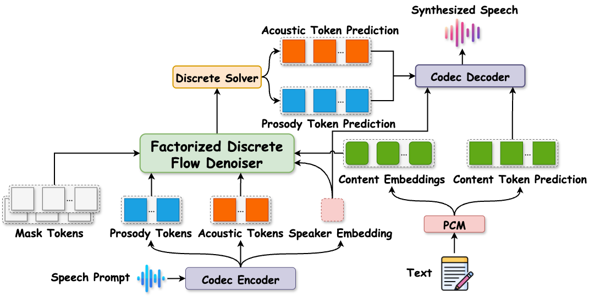
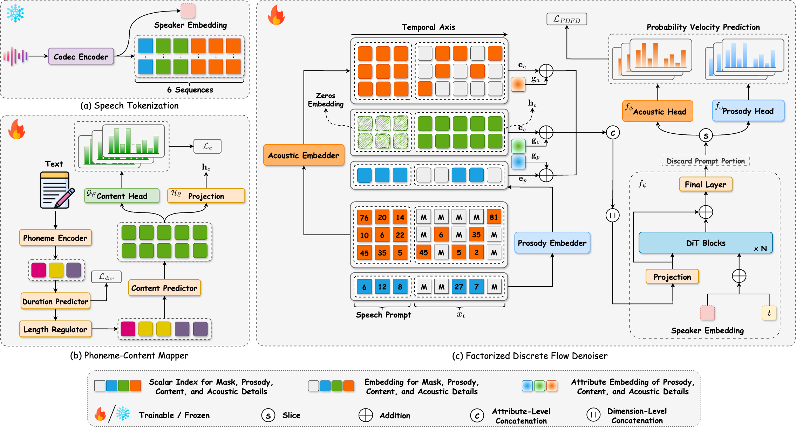

<div align="center">

<h1>DiFlow-TTS: Discrete Flow Matching with Factorized Speech Tokens for Low-Latency Zero-Shot Text-to-Speech</h1>

[[Project Page]](https://diflow-tts.github.io/)

---

</div>

#### 🚩 Submitted to AAAI 2026

## 🔥 News
- [Coming soon] Release evaluation code.
- [Coming soon] Release training instructions.
- [2025.08] Release inference code.
- [2025.08] This repo is created.

## 🗣️ Overview
**DiFlow-TTS** is a novel zero-shot text-to-speech system that leverages purely discrete flow matching with factorized speech token modeling.
<br>
<div align="center">

</div>
<br>

<br>
<div align="center">

</div>
<br>


## 🛠️ Dependencies & Installation

### 1. Set Up the Environment

Install the required dependencies using Conda:

```bash
conda env create -f environment.yaml
conda activate diflow
```
### 2. Download Models
- Download the pretrained FACodec model from [HuggingFace](https://huggingface.co/amphion/naturalspeech3_facodec), and place the checkpoint files in the following structure:
```
root/
└── models/
    └── facodec/
        └── checkpoints/
            ├── ns3_facodec_encoder.bin
            └── ns3_facodec_decoder.bin

```
- Download the DiFlow-TTS model checkpoint from [Link](https://drive.google.com/file/d/1uV80fSVfmIWctnGR8KUbcZvtmBZZwJZM/view?usp=sharing), and place it as follows:
```
root/
└── ckpts/
    └── diflow-tts.ckpt
```
## 🚀 2. Quick Inference

To synthesize a sample with DiFlow-TTS, follow these steps:

1. Open the script: [`scripts/synth_one_sample.sh`](scripts/synth_one_sample.sh)

2. Edit the following lines:

   * **Line 3**: Set the path to the DiFlow-TTS checkpoint.
   * **Line 4**: Set your input text.
   * **Line 5**: Set the path to your reference speech prompt.

3. Run the script with:

```bash
CUDA_VISIBLE_DEVICES=0 bash scripts/synth_one_sample.sh
```

> Make sure the model checkpoint and audio prompt are correctly formatted and accessible at the specified paths.

## 🏋️‍♂️ 3. Training
Coming soon